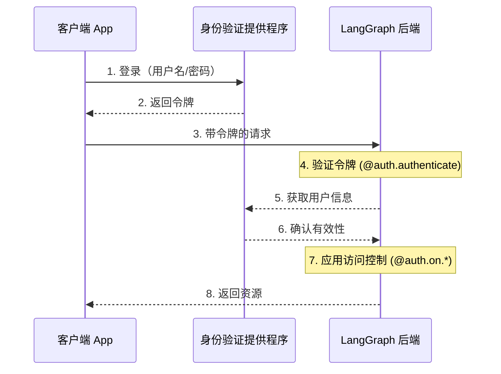
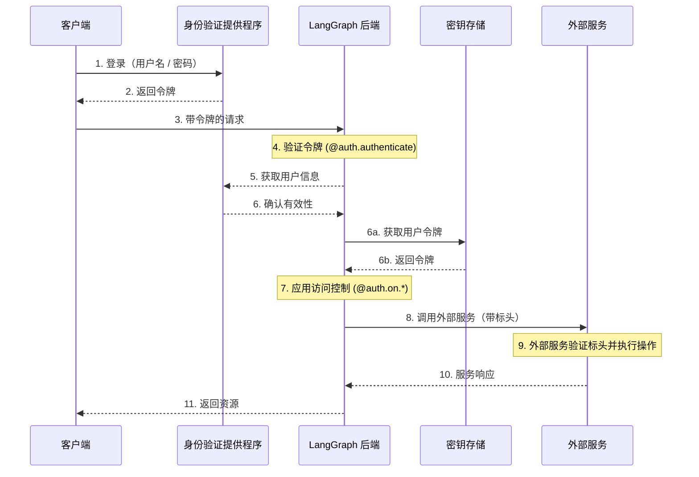

---
search:
  boost: 2
---

# 身份验证与访问控制

LangGraph Platform 提供了一个灵活的身份验证和授权系统，可以与大多数身份验证方案集成。

## 核心概念

### 身份验证（Authentication）与授权（Authorization）

这两个术语经常被混用，但它们代表着截然不同的安全概念：

- **身份验证**（"AuthN"）验证你是**谁**。它作为中间件（middleware）处理每个请求。
- **授权**（"AuthZ"）决定你**能做什么**。它在每个资源的基础上验证用户的权限和角色。

:::python
在 LangGraph Platform 中，身份验证由你的 [`@auth.authenticate`](../cloud/reference/sdk/python_sdk_ref.md#langgraph_sdk.auth.Auth.authenticate) 处理程序负责，授权由你的 [`@auth.on`](../cloud/reference/sdk/python_sdk_ref.md#langgraph_sdk.auth.Auth.on) 处理程序负责。
:::

:::js
在 LangGraph Platform 中，身份验证由你的 [`@auth.authenticate`](../cloud/reference/sdk/typescript_sdk_ref.md#auth.authenticate) 处理程序负责，授权由你的 [`@auth.on`](../cloud/reference/sdk/typescript_sdk_ref.md#auth.on) 处理程序负责。
:::

## 默认安全模型

LangGraph Platform 提供不同的安全默认设置：

### LangGraph Platform

- 默认使用 LangSmith API 密钥。
- 需要在 `x-api-key` 标头中提供有效的 API 密钥。
- 可以通过自定义你的身份验证处理程序进行定制。

!!! note "自定义身份验证"

   LangGraph Platform 的所有套餐均**支持**自定义身份验证。

### 自托管

- 没有默认身份验证。
- 为实现你的安全模型提供完全的灵活性。
- 你可以控制身份验证和授权的所有方面。

## 系统架构

典型的身份验证设置涉及三个主要组件：

1. **身份验证提供程序** (Identity Provider/IdP)

   - 一个专门的服务，用于管理用户身份和凭据。
   - 处理用户注册、登录、密码重置等。
   - 在成功身份验证后颁发令牌（JWT、Session 令牌等）。
   - 示例：Auth0、Supabase Auth、Okta，或你自己的身份验证服务器。

2. **LangGraph 后端** (Resource Server)

   - 包含业务逻辑和受保护资源的 LangGraph 应用程序。
   - 使用身份验证提供程序验证令牌。
   - 基于用户身份和权限强制执行访问控制。
   - 不直接存储用户凭据。

3. **客户端应用程序** (Frontend)

   - Web 应用、移动应用或 API 客户端。
   - 收集用户敏感凭据并发送给身份验证提供程序。
   - 从身份验证提供程序接收令牌。
   - 在发送给 LangGraph 后端的请求中包含这些令牌。

以下是这些组件通常如何交互：



:::python
LangGraph 中的 [`@auth.authenticate`](../cloud/reference/sdk/python_sdk_ref.md#langgraph_sdk.auth.Auth.authenticate) 处理程序负责处理步骤 4-6，而你的 [`@auth.on`](../cloud/reference/sdk/python_sdk_ref.md#langgraph_sdk.auth.Auth.on) 处理程序则实现步骤 7。
:::

:::js
LangGraph 中的 [`auth.authenticate`](https://langchain-ai.github.io/langgraph/cloud/reference/sdk/js_ts_sdk_ref/#authenticate) 处理程序负责处理步骤 4-6，而你的 [`auth.on`](https://langchain-ai.github.io/langgraph/cloud/reference/sdk/js_ts_sdk_ref/#auth.on) 处理程序则实现步骤 7。
:::

## 身份验证

:::python
LangGraph 中的身份验证作为中间件（middleware）对每个请求运行。你的 [`@auth.authenticate`](../cloud/reference/sdk/python_sdk_ref.md#langgraph_sdk.auth.Auth.authenticate) 处理程序会接收请求信息，并应执行以下操作：

1. 验证凭据。
2. 如果凭据有效，则返回包含用户身份和用户信息的 [用户信息](../cloud/reference/sdk/python_sdk_ref.md#langgraph_sdk.auth.types.MinimalUserDict)。
3. 如果凭据无效，则引发 [HTTPException](../cloud/reference/sdk/python_sdk_ref.md#langgraph_sdk.auth.exceptions.HTTPException) 或 AssertionError。

```python
from langgraph_sdk import Auth

auth = Auth()

@auth.authenticate
async def authenticate(headers: dict) -> Auth.types.MinimalUserDict:
    # 验证凭据（例如，API 密钥，JWT 令牌）
    api_key = headers.get("x-api-key")
    if not api_key or not is_valid_key(api_key):
        raise Auth.exceptions.HTTPException(
            status_code=401,
            detail="无效的 API 密钥"
        )

    # 返回用户信息 - 仅身份和 is_authenticated 是必需的
    # 添加你需要的任何其他字段用于授权
    return {
        "identity": "user-123",        # 必需：唯一的用户名标识符
        "is_authenticated": True,      # 可选：默认假定为 True
        "permissions": ["read", "write"] # 可选：用于基于权限的授权
        # 如果你想实现其他身份验证模式，可以添加更多自定义字段
        "role": "admin",
        "org_id": "org-456"

    }
```

返回的用户信息可用：

- 在你的授权处理程序中，通过 [`ctx.user`](../cloud/reference/sdk/python_sdk_ref.md#langgraph_sdk.auth.types.AuthContext) 访问。
- 在你的应用程序中，通过 `config["configuration"]["langgraph_auth_user"]` 访问。
  :::

:::js
LangGraph 中的身份验证作为中间件（middleware）对每个请求运行。你的 [`authenticate`](https://langchain-ai.github.io/langgraph/cloud/reference/sdk/js_ts_sdk_ref/#authenticate>) 处理程序会接收请求信息，并应执行以下操作：

1. 验证凭据。
2. 如果凭据有效，则返回包含用户身份和用户信息的**用户对象**。
3. 如果凭据无效，则引发 [HTTPException](https://langchain-ai.github.io/langgraph/cloud/reference/sdk/js_ts_sdk_ref/#class-httpexception>)。

```typescript
import { Auth, HTTPException } from "@langchain/langgraph-sdk";

export const auth = new Auth();

auth.authenticate(async (request) => {
  // 验证凭据（例如，API 密钥，JWT 令牌）
  const apiKey = request.headers.get("x-api-key");
  if (!apiKey || !isValidKey(apiKey)) {
    throw new HTTPException(401, "无效的 API 密钥");
  }

  // 返回用户信息 - 仅 identity 和 isAuthenticated 是必需的
  // 添加你需要的任何其他字段用于授权
  return {
    identity: "user-123", // 必需：唯一的用户名标识符
    isAuthenticated: true, // 可选：默认假定为 true
    permissions: ["read", "write"], // 可选：用于基于权限的授权
    // 如果你想实现其他身份验证模式，可以添加更多自定义字段
    role: "admin",
    orgId: "org-456",
  };
});
```

返回的用户信息可用：

- 在你的授权处理程序中，通过 [回调处理程序](https://langchain-ai.github.io/langgraph/cloud/reference/sdk/js_ts_sdk_ref/#on) 中的 `user` 属性访问。
- 在你的应用程序中，通过 `config.configurable.langgraph_auth_user` 访问。
  :::

??? tip "支持的参数"

    :::python
    [`@auth.authenticate`](../cloud/reference/sdk/python_sdk_ref.md#langgraph_sdk.auth.Auth.authenticate) 处理程序可以按名称接受以下任何参数：

    * `request` (Request)：原始 ASGI 请求对象。
    * `body` (dict)：解析后的请求体。
    * `path` (str)：请求路径，例如 "/threads/abcd-1234-abcd-1234/runs/abcd-1234-abcd-1234/stream"。
    * `method` (str)：HTTP 方法，例如 "GET"。
    * `path_params` (dict[str, str])：URL 路径参数，例如 `{"thread_id": "abcd-1234-abcd-1234", "run_id": "abcd-1234-abcd-1234"}`。
    * `query_params` (dict[str, str])：URL 查询参数，例如 `{"stream": "true"}`。
    * `headers` (dict[bytes, bytes])：请求标头。
    * `authorization` (str | None)：Authorization 标头的值（例如，"Bearer <token>"）。
    :::

    :::js
    [`authenticate`](https://langchain-ai.github.io/langgraph/cloud/reference/sdk/js_ts_sdk_ref/#authenticate) 处理程序可以接受以下任何参数：

    * `request` (Request)：原始请求对象。
    * `body` (object)：解析后的请求体。
    * `path` (string)：请求路径，例如 "/threads/abcd-1234-abcd-1234/runs/abcd-1234-abcd-1234/stream"。
    * `method` (string)：HTTP 方法，例如 "GET"。
    * `pathParams` (Record<string, string>)：URL 路径参数，例如 `{"threadId": "abcd-1234-abcd-1234", "runId": "abcd-1234-abcd-1234"}`。
    * `queryParams` (Record<string, string>)：URL 查询参数，例如 `{"stream": "true"}`。
    * `headers` (Record<string, string>)：请求标头。
    * `authorization` (string | null)：Authorization 标头的值（例如，"Bearer <token>"）。
    :::

    在许多教程中，为了简洁起见，我们只会展示 "authorization" 参数，但你可以选择接受更多信息以实现自定义身份验证方案。

### Agent 身份验证

自定义身份验证允许委托访问。你在 `@auth.authenticate` 中返回的值会被添加到运行上下文中，让代理拥有用户范围的凭据，使它们能够代表用户访问资源。



身份验证后，平台会创建一个特殊的配置对象，通过可配置上下文（configurable context）传递给你的图（graph）和所有节点。
此对象包含有关当前用户的信息，包括你从 [`@auth.authenticate`](../cloud/reference/sdk/python_sdk_ref.md#langgraph_sdk.auth.Auth.authenticate) 处理程序返回的任何自定义字段。

要使代理能够代表用户执行操作，请使用 [自定义身份验证中间件](../how-tos/auth/custom_auth.md)。这将允许代理代表用户与外部系统（如 MCP 服务器、外部数据库甚至其他代理）进行交互。

有关更多信息，请参阅 [使用自定义身份验证](../how-tos/auth/custom_auth.md#enable-agent-authentication) 指南。

### 使用 MCP 进行 Agent 身份验证

有关如何将 Agent 身份验证到 MCP 服务器的信息，请参阅 [MCP 概念指南](../concepts/mcp.md)。

## 授权

身份验证后，LangGraph 会调用你的授权处理程序来控制对特定资源的访问（例如，threads、assistants、crons）。这些处理程序可以：

1. 通过修改元数据来添加在创建资源时保存的元数据。有关每个操作的 `value` 可以采用的类型列表，请参阅 [支持的操作表](#supported-actions)。
2. 在搜索/列表或读取操作期间，通过返回 [过滤器](#filter-operations) 来过滤元数据资源。
3. 如果访问被拒绝，则引发 HTTP 异常。

如果你只想实现简单的用户作用域访问控制，可以为所有资源和操作使用一个授权处理程序。如果你希望根据资源和操作进行不同的控制，可以使用 [特定资源的处理程序](#resource-specific-handlers)。有关支持访问控制的资源的完整列表，请参阅 [支持的资源](#supported-resources) 部分。

:::python
你的 [`@auth.on`](../cloud/reference/sdk/python_sdk_ref.md#langgraph_sdk.auth.Auth.on) 处理程序通过直接修改 `value["metadata"]` 字典并返回 [过滤器对象](#filter-operations) 来控制访问。

```python
@auth.on
async def add_owner(
    ctx: Auth.types.AuthContext,
    value: dict  # 发送到此访问方法的载荷（payload）
) -> dict:  # 返回一个限制对资源访问的过滤器字典
    """授权对 threads, runs, crons, 和 assistants 的所有访问。

    此处理程序执行两项操作：
        - 向资源元数据添加一个值（以持久化存储，以便稍后进行过滤）
        - 返回一个过滤器（以限制对现有资源的访问）

    Args:
        ctx: 身份验证上下文，包含用户信息、权限、路径以及
        value: 发送到端点的请求载荷。对于创建操作，此载荷包含资源参数。对于读取操作，此载荷包含正在访问的资源。

    Returns:
        一个 LangGraph 用于限制对资源访问的过滤器字典。
        有关支持的运算符，请参阅 [过滤器操作](#filter-operations)。
    """
    # 创建过滤器以仅将访问限制为此用户的资源
    filters = {"owner": ctx.user.identity}

    # 获取或创建载荷中的元数据字典
    # 这是我们存储资源持久信息的地方
    metadata = value.setdefault("metadata", {})

    # 将 owner 添加到元数据 - 如果这是一个创建或更新操作，
    # 此信息将与资源一起保存，
    # 这样我们就可以在读取操作中按此进行过滤
    metadata.update(filters)

    # 返回过滤器以限制访问
    # 这些过滤器应用于所有操作（创建、读取、更新、搜索等）
    # 以确保用户只能访问他们自己的资源
    return filters
```

:::

:::js
你可以通过直接修改 `value.metadata` 对象并注册 [`on()`](https://langchain-ai.github.io/langgraph/cloud/reference/sdk/js_ts_sdk_ref/#on) 处理程序时返回一个 [过滤器对象](#filter-operations) 来精细地控制访问。

```typescript
import { Auth, HTTPException } from "@langchain/langgraph-sdk/auth";

export const auth = new Auth()
  .authenticate(async (request: Request) => ({
    identity: "user-123",
    permissions: [],
  }))
  .on("*", ({ value, user }) => {
    // 创建过滤器以仅将访问限制为此用户的资源
    const filters = { owner: user.identity };

    // 如果操作支持元数据，请将用户身份
    // 作为元数据添加到资源。
    if ("metadata" in value) {
      value.metadata ??= {};
      value.metadata.owner = user.identity;
    }

    // 返回过滤器以限制访问
    // 这些过滤器应用于所有操作（创建、读取、更新、搜索等）
    // 以确保用户只能访问他们自己的资源
    return filters;
  });
```

:::

### 特定资源的处理程序 {#resource-specific-handlers}

你可以通过将资源和操作名称与授权装饰器链接起来，为特定资源和操作注册处理程序。
当发出请求时，最匹配该资源和操作的最具体处理程序将被调用。下面是如何为特定资源和操作注册处理程序的示例。对于以下设置：

1. 经过身份验证的用户可以创建 threads、读取 threads 并创建 runs on threads。
2. 只有拥有 "assistants:create" 权限的用户才能创建新的 assistants。
3. 所有其他端点（例如，删除 assistant、crons、store）对所有用户都禁用。

!!! tip "支持的处理程序"

    有关受支持资源和操作的完整列表，请参阅下面的[支持的资源](#supported-resources)部分。

:::python

```python
# 通用的 / 全局处理程序会捕获未被更具体处理程序处理的调用
@auth.on
async def reject_unhandled_requests(ctx: Auth.types.AuthContext, value: Any) -> False:
    print(f"Request to {ctx.path} by {ctx.user.identity}")
    raise Auth.exceptions.HTTPException(
        status_code=403,
        detail="禁止访问"
    )

# 匹配 "thread" 资源和所有操作 - 创建、读取、更新、删除、搜索
# 由于这比通用的 @auth.on 处理程序 **更具体**，因此它将优先于
# "threads" 资源的所有操作的通用处理程序
@auth.on.threads
async def on_thread_create(
    ctx: Auth.types.AuthContext,
    value: Auth.types.threads.create.value
):
    if "write" not in ctx.permissions:
        raise Auth.exceptions.HTTPException(
            status_code=403,
            detail="用户缺少所需的权限。"
        )
    # 在正在创建的 thread 上设置元数据
    # 将确保资源包含 "owner" 字段
    # 这样，当用户尝试访问此 thread 或 thread 中的 run 时，
    # 我们就可以按 owner 进行过滤
    metadata = value.setdefault("metadata", {})
    metadata["owner"] = ctx.user.identity
    return {"owner": ctx.user.identity}

# Thread creation。这将仅匹配 thread 创建操作。
# 由于这比通用的 @auth.on 处理程序和 @auth.on.threads 处理程序 **更具体**，
# 因此它将优先于 "threads" 资源的所有 "create" 操作
@auth.on.threads.create
async def on_thread_create(
    ctx: Auth.types.AuthContext,
    value: Auth.types.threads.create.value
):
    # 在正在创建的 thread 上设置元数据
    # 将确保资源包含 "owner" 字段
    # 这样，当用户尝试访问此 thread 或 thread 中的 run 时，
    # 我们就可以按 owner 进行过滤
    metadata = value.setdefault("metadata", {})
    metadata["owner"] = ctx.user.identity
    return {"owner": ctx.user.identity}

# 读取 thread。由于这比通用的 @auth.on 处理程序和 @auth.on.threads 处理程序 **更具体**，
# 它将优先于 "threads" 资源的所有 "read" 操作
@auth.on.threads.read
async def on_thread_read(
    ctx: Auth.types.AuthContext,
    value: Auth.types.threads.read.value
):
    # 由于我们正在读取（而不是创建）thread，
    # 我们不需要设置元数据。我们只需要
    # 返回一个过滤器，以确保用户只能看到他们自己的 thread
    return {"owner": ctx.user.identity}

# Run creation, streaming, updates, etc.
# 这比通用的 @auth.on 处理程序和 @auth.on.threads 处理程序优先
@auth.on.threads.create_run
async def on_run_create(
    ctx: Auth.types.AuthContext,
    value: Auth.types.threads.create_run.value
):
    metadata = value.setdefault("metadata", {})
    metadata["owner"] = ctx.user.identity
    # 继承 thread 的访问控制
    return {"owner": ctx.user.identity}

# Assistant creation
@auth.on.assistants.create
async def on_assistant_create(
    ctx: Auth.types.AuthContext,
    value: Auth.types.assistants.create.value
):
    if "assistants:create" not in ctx.permissions:
        raise Auth.exceptions.HTTPException(
            status_code=403,
            detail="用户缺少所需的权限。"
        )
```

:::

:::js

```typescript
import { Auth, HTTPException } from "@langchain/langgraph-sdk/auth";

export const auth = new Auth()
  .authenticate(async (request: Request) => ({
    identity: "user-123",
    permissions: ["threads:write", "threads:read"],
  }))
  .on("*", ({ event, user }) => {
    console.log(`Request for ${event} by ${user.identity}`);
    throw new HTTPException(403, { message: "Forbidden" });
  })

  // Matches the "threads" resource and all actions - create, read, update, delete, search
  // Since this is **more specific** than the generic `on("*")` handler, it will take precedence over the generic handler for all actions on the "threads" resource
  .on("threads", ({ permissions, value, user }) => {
    if (!permissions.includes("write")) {
      throw new HTTPException(403, {
        message: "User lacks the required permissions.",
      });
    }

    // Not all events do include `metadata` property in `value`.
    // So we need to add this type guard.
    if ("metadata" in value) {
      value.metadata ??= {};
      value.metadata.owner = user.identity;
    }

    return { owner: user.identity };
  })

  // Thread creation. This will match only on thread create actions.
  // Since this is **more specific** than both the generic `on("*")` handler and the `on("threads")` handler, it will take precedence for any "create" actions on the "threads" resources
  .on("threads:create", ({ value, user, permissions }) => {
    if (!permissions.includes("write")) {
      throw new HTTPException(403, {
        message: "User lacks the required permissions.",
      });
    }

    // Setting metadata on the thread being created will ensure that the resource contains an "owner" field
    // Then any time a user tries to access this thread or runs within the thread,
    // we can filter by owner
    value.metadata ??= {};
    value.metadata.owner = user.identity;

    return { owner: user.identity };
  })

  // Reading a thread. Since this is also more specific than the generic `on("*")` handler, and the `on("threads")` handler,
  .on("threads:read", ({ user }) => {
    // Since we are reading (and not creating) a thread,
    // we don't need to set metadata. We just need to
    // return a filter to ensure users can only see their own threads.
    return { owner: user.identity };
  })

  // Run creation, streaming, updates, etc.
  // This takes precedence over the generic `on("*")` handler and the `on("threads")` handler
  .on("threads:create_run", ({ value, user }) => {
    value.metadata ??= {};
    value.metadata.owner = user.identity;

    return { owner: user.identity };
  })

  // Assistant creation. This will match only on assistant create actions.
  // Since this is **more specific** than both the generic `on("*")` handler and the `on("assistants")` handler, it will take precedence for any "create" actions on the "assistants" resources
  .on("assistants:create", ({ value, user, permissions }) => {
    if (!permissions.includes("assistants:create")) {
      throw new HTTPException(403, {
        message: "User lacks the required permissions.",
      });
    }

    // Setting metadata on the assistant being created will ensure that the resource contains an "owner" field.
    // Then any time a user tries to access this assistant, we can filter by owner
    value.metadata ??= {};
    value.metadata.owner = user.identity;

    return { owner: user.identity };
  });
```

:::

请注意，我们正在混合使用全局和特定资源的处理程序。由于每个请求都由最具体（most specific）的处理程序处理，因此创建 `thread` 的请求将匹配 `on_thread_create` 处理程序，但**不**匹配 `reject_unhandled_requests` 处理程序。然而，更新 thread 的请求将由全局处理程序处理，因为我们没有为该资源和操作提供更具体（more specific）的处理程序。

### 过滤器操作 {#filter-operations}

:::python
授权处理程序可以返回不同类型的值：

- `None` 和 `True` 表示“授权访问所有底层资源”。
- `False` 表示“拒绝访问所有底层资源（引发 403 异常）”。
- 元数据过滤器字典将限制对资源的访问。

过滤器字典是键与资源元数据匹配的字典。它支持三种运算符：

- 默认值是精确匹配（exact match）或 "$eq" 的简写形式，如下所示。例如，`{"owner": user_id}` 将只包含元数据包含 `{"owner": user_id}` 的资源。
- `$eq`：精确匹配（例如，`{"owner": {"$eq": user_id}}`）- 这等同于上面的简写形式 `{"owner": user_id}`。
- `$contains`：列表成员资格（例如，`{"allowed_users": {"$contains": user_id}}`）。此处的值必须是列表中的一个元素。存储在资源中的元数据必须是列表/容器类型。

具有多个键的字典被视为使用逻辑 `AND` 进行过滤。例如，`{"owner": org_id, "allowed_users": {"$contains": user_id}}` 将只匹配元数据中 "owner" 为 `org_id` 且 "allowed_users" 列表包含 `user_id` 的资源。
有关更多信息，请参阅此处的参考[文档](../cloud/reference/sdk/python_sdk_ref.md#langgraph_sdk.auth.types.FilterType)。
:::

:::js
授权处理程序可以返回不同类型的值：

- `null` 和 `true` 表示“授权访问所有底层资源”。
- `false` 表示“拒绝访问所有底层资源（引发 403 异常）”。
- 元数据过滤器对象将限制对资源的访问。

过滤器对象是键与资源元数据匹配的对象。它支持三种运算符：

- 默认值是精确匹配（exact match）或 "$eq" 的简写形式，如下所示。例如，`{ owner: userId}` 将只包含元数据包含 `{ owner: userId }` 的资源。
- `$eq`：精确匹配（例如，`{ owner: { $eq: userId } }`）- 这等同于上面的简写形式 `{ owner: userId }`。
- `$contains`：列表成员资格（例如，`{ allowedUsers: { $contains: userId \} }`）。此处的值必须是列表中的一个元素。存储在资源中的元数据必须是列表/容器类型。

具有多个键的对象被视为使用逻辑 `AND` 进行过滤。例如，`{ owner: orgId, allowedUsers: { $contains: userId \} }` 将只匹配元数据中 "owner" 为 `orgId` 且 "allowedUsers" 列表包含 `userId` 的资源。
有关更多信息，请参阅此处的参考[文档](../cloud/reference/sdk/typescript_sdk_ref.md#auth.types.FilterType)。
:::

## 常见访问模式

以下是一些典型的授权模式：

### 单所有者资源 (Single-Owner Resources)

这种常见的模式允许你将所有 threads、assistants、crons 和 runs 的作用域限制为单个用户。对于常规的类似聊天机器人的应用程序等常见单用户用例非常有用。

:::python

```python
@auth.on
async def owner_only(ctx: Auth.types.AuthContext, value: dict):
    metadata = value.setdefault("metadata", {})
    metadata["owner"] = ctx.user.identity
    return {"owner": ctx.user.identity}
```

:::

:::js

```typescript
export const auth = new Auth()
  .authenticate(async (request: Request) => ({
    identity: "user-123",
    permissions: ["threads:write", "threads:read"],
  }))
  .on("*", ({ value, user }) => {
    if ("metadata" in value) {
      value.metadata ??= {};
      value.metadata.owner = user.identity;
    }
    return { owner: user.identity };
  });
```

:::

### 基于权限的访问 (Permission-based Access)

这种模式允许你基于**权限**来控制访问。如果你希望某些角色拥有更广泛或更受限制的资源访问权限，这非常有用。

:::python

```python
# 在你的身份验证处理程序中：
@auth.authenticate
async def authenticate(headers: dict) -> Auth.types.MinimalUserDict:
    ...
    return {
        "identity": "user-123",
        "is_authenticated": True,
        "permissions": ["threads:write", "threads:read"]  # 在 auth 中定义权限
    }

def _default(ctx: Auth.types.AuthContext, value: dict):
    metadata = value.setdefault("metadata", {})
    metadata["owner"] = ctx.user.identity
    return {"owner": ctx.user.identity}

@auth.on.threads.create
async def create_thread(ctx: Auth.types.AuthContext, value: dict):
    if "threads:write" not in ctx.permissions:
        raise Auth.exceptions.HTTPException(
            status_code=403,
            detail="无权访问"
        )
    return _default(ctx, value)


@auth.on.threads.read
async def rbac_create(ctx: Auth.types.AuthContext, value: dict):
    if "threads:read" not in ctx.permissions and "threads:write" not in ctx.permissions:
        raise Auth.exceptions.HTTPException(
            status_code=403,
            detail="无权访问"
        )
    return _default(ctx, value)
```

:::

:::js

```typescript
import { Auth, HTTPException } from "@langchain/langgraph-sdk/auth";

export const auth = new Auth()
  .authenticate(async (request: Request) => ({
    identity: "user-123",
    // 在 auth 中定义权限
    permissions: ["threads:write", "threads:read"],
  }))
  .on("threads:create", ({ value, user, permissions }) => {
    if (!permissions.includes("threads:write")) {
      throw new HTTPException(403, { message: "Unauthorized" });
    }

    if ("metadata" in value) {
      value.metadata ??= {};
      value.metadata.owner = user.identity;
    }
    return { owner: user.identity };
  })
  .on("threads:read", ({ user, permissions }) => {
    if (
      !permissions.includes("threads:read") &&
      !permissions.includes("threads:write")
    ) {
      throw new HTTPException(403, { message: "Unauthorized" });
    }

    return { owner: user.identity };
  });
```

:::

## 支持的资源

LangGraph 提供三个级别的授权处理程序，从最通用到最具体：

:::python

1. **全局处理程序** (`@auth.on`)：匹配所有资源和操作。
2. **资源处理程序**（例如，`@auth.on.threads`、`@auth.on.assistants`、`@auth.on.crons`）：匹配特定资源的所有操作。
3. **操作处理程序**（例如，`@auth.on.threads.create`、`@auth.on.threads.read`）：匹配特定资源上的特定操作。

将使用最具体（most specific）的匹配处理程序。例如，`@auth.on.threads.create` 在 thread 创建时优先于 `@auth.on.threads`。
如果注册了更具体（more specific）的处理程序，则对于该资源和操作，将不会调用更通用的处理程序。
:::

:::js

1. **全局处理程序** (`on("*")`)：匹配所有资源和操作。
2. **资源处理程序**（例如，`on("threads")`、`on("assistants")`、`on("crons")`）：匹配特定资源的所有操作。
3. **操作处理程序**（例如，`on("threads:create")`、`on("threads:read")`）：匹配特定资源上的特定操作。

将使用最具体（most specific）的匹配处理程序。例如，`on("threads:create")` 在 thread 创建时优先于 `on("threads")`。
如果注册了更具体（more specific）的处理程序，则对于该资源和操作，将不会调用更通用的处理程序。
:::

:::python
???+ tip "类型安全"
每个处理程序都有其 `value` 参数的类型提示。例如：

    ```python
    @auth.on.threads.create
    async def on_thread_create(
        ctx: Auth.types.AuthContext,
        value: Auth.types.on.threads.create.value  # 线程创建的特定类型
    ):
        ...

    @auth.on.threads
    async def on_threads(
        ctx: Auth.types.AuthContext,
        value: Auth.types.on.threads.value  # 所有 thread 操作的联合类型
    ):
        ...

    @auth.on
    async def on_all(
        ctx: Auth.types.AuthContext,
        value: dict  # 所有可能操作的联合类型
    ):
        ...
    ```

    由于更具体（more specific）的处理程序处理的操作类型较少，因此它们提供更好的类型提示。

:::

#### 支持的操作和类型 {#supported-actions}

以下是所有支持的操作处理程序：

:::python
| 资源 | 处理程序 | 描述 | 值类型 |
|---|---|---|---|
| **Threads** | `@auth.on.threads.create` | Thread 创建 | [`ThreadsCreate`](../cloud/reference/sdk/python_sdk_ref.md#langgraph_sdk.auth.types.ThreadsCreate) |
| | `@auth.on.threads.read` | Thread 检索 | [`ThreadsRead`](../cloud/reference/sdk/python_sdk_ref.md#langgraph_sdk.auth.types.ThreadsRead) |
| | `@auth.on.threads.update` | Thread 更新 | [`ThreadsUpdate`](../cloud/reference/sdk/python_sdk_ref.md#langgraph_sdk.auth.types.ThreadsUpdate) |
| | `@auth.on.threads.delete` | Thread 删除 | [`ThreadsDelete`](../cloud/reference/sdk/python_sdk_ref.md#langgraph_sdk.auth.types.ThreadsDelete) |
| | `@auth.on.threads.search` | 列出 threads | [`ThreadsSearch`](../cloud/reference/sdk/python_sdk_ref.md#langgraph_sdk.auth.types.ThreadsSearch) |
| | `@auth.on.threads.create_run` | 创建或更新 run | [`RunsCreate`](../cloud/reference/sdk/python_sdk_ref.md#langgraph_sdk.auth.types.RunsCreate) |
| **Assistants** | `@auth.on.assistants.create` | Assistant 创建 | [`AssistantsCreate`](../cloud/reference/sdk/python_sdk_ref.md#langgraph_sdk.auth.types.AssistantsCreate) |
| | `@auth.on.assistants.read` | Assistant 检索 | [`AssistantsRead`](../cloud/reference/sdk/python_sdk_ref.md#langgraph_sdk.auth.types.AssistantsRead) |
| | `@auth.on.assistants.update` | Assistant 更新 | [`AssistantsUpdate`](../cloud/reference/sdk/python_sdk_ref.md#langgraph_sdk.auth.types.AssistantsUpdate) |
| | `@auth.on.assistants.delete` | Assistant 删除 | [`AssistantsDelete`](../cloud/reference/sdk/python_sdk_ref.md#langgraph_sdk.auth.types.AssistantsDelete) |
| | `@auth.on.assistants.search` | 列出 assistants | [`AssistantsSearch`](../cloud/reference/sdk/python_sdk_ref.md#langgraph_sdk.auth.types.AssistantsSearch) |
| **Crons** | `@auth.on.crons.create` | Cron job 创建 | [`CronsCreate`](../cloud/reference/sdk/python_sdk_ref.md#langgraph_sdk.auth.types.CronsCreate) |
| | `@auth.on.crons.read` | Cron job 检索 | [`CronsRead`](../cloud/reference/sdk/python_sdk_ref.md#langgraph_sdk.auth.types.CronsRead) |
| | `@auth.on.crons.update` | Cron job 更新 | [`CronsUpdate`](../cloud/reference/sdk/python_sdk_ref.md#langgraph_sdk.auth.types.CronsUpdate) |
| | `@auth.on.crons.delete` | Cron job 删除 | [`CronsDelete`](../cloud/reference/sdk/python_sdk_ref.md#langgraph_sdk.auth.types.CronsDelete) |
| | `@auth.on.crons.search` | 列出 cron jobs | [`CronsSearch`](../cloud/reference/sdk/python_sdk_ref.md#langgraph_sdk.auth.types.CronsSearch) |
:::

:::js
| 资源 | 事件 | 描述 | 值类型 |
| -------------- | -------------------- | -------------------------- | ------------------------------------------------------------------------------------------------------------------ |
| **Threads** | `threads:create` | Thread 创建 | [`ThreadsCreate`](https://langchain-ai.github.io/langgraph/cloud/reference/sdk/js_ts_sdk_ref/#threadscreate) |
| | `threads:read` | Thread 检索 | [`ThreadsRead`](https://langchain-ai.github.io/langgraph/cloud/reference/sdk/js_ts_sdk_ref/#threadsread) |
| | `threads:update` | Thread 更新 | [`ThreadsUpdate`](https://langchain-ai.github.io/langgraph/cloud/reference/sdk/js_ts_sdk_ref/#threadsupdate) |
| | `threads:delete` | Thread 删除 | [`ThreadsDelete`](https://langchain-ai.github.io/langgraph/cloud/reference/sdk/js_ts_sdk_ref/#threadsdelete) |
| | `threads:search` | 列出 threads | [`ThreadsSearch`](https://langchain-ai.github.io/langgraph/cloud/reference/sdk/js_ts_sdk_ref/#threadssearch) |
| | `threads:create_run` | 创建或更新 run | [`RunsCreate`](https://langchain-ai.github.io/langgraph/cloud/reference/sdk/js_ts_sdk_ref/#threadscreate_run) |
| **Assistants** | `assistants:create` | Assistant 创建 | [`AssistantsCreate`](https://langchain-ai.github.io/langgraph/cloud/reference/sdk/js_ts_sdk_ref/#assistantscreate) |
| | `assistants:read` | Assistant 检索 | [`AssistantsRead`](https://langchain-ai.github.io/langgraph/cloud/reference/sdk/js_ts_sdk_ref/#assistantsread) |
| | `assistants:update` | Assistant 更新 | [`AssistantsUpdate`](https://langchain-ai.github.io/langgraph/cloud/reference/sdk/js_ts_sdk_ref/#assistantsupdate) |
| | `assistants:delete` | Assistant 删除 | [`AssistantsDelete`](https://langchain-ai.github.io/langgraph/cloud/reference/sdk/js_ts_sdk_ref/#assistantsdelete) |
| | `assistants:search` | 列出 assistants | [`AssistantsSearch`](https://langchain-ai.github.io/langgraph/cloud/reference/sdk/js_ts_sdk_ref/#assistantssearch) |
| **Crons** | `crons:create` | Cron job 创建 | [`CronsCreate`](https://langchain-ai.github.io/langgraph/cloud/reference/sdk/js_ts_sdk_ref/#cronscreate) |
| | `crons:read` | Cron job 检索 | [`CronsRead`](https://langchain-ai.github.io/langgraph/cloud/reference/sdk/js_ts_sdk_ref/#cronsread) |
| | `crons:update` | Cron job 更新 | [`CronsUpdate`](https://langchain-ai.github.io/langgraph/cloud/reference/sdk/js_ts_sdk_ref/#cronsupdate) |
| | `crons:delete` | Cron job 删除 | [`CronsDelete`](https://langchain-ai.github.io/langgraph/cloud/reference/sdk/js_ts_sdk_ref/#cronsdelete) |
| | `crons:search` | 列出 cron jobs | [`CronsSearch`](https://langchain-ai.github.io/langgraph/cloud/reference/sdk/js_ts_sdk_ref/#cronssearch) |
:::

???+ note "关于 Runs"

    Runs 的访问控制作用域限定在其父 thread 中。这意味着权限通常从 thread 继承，反映了数据模型的对话性质。除创建外，所有 run 操作（读取、列出）均受 thread 的处理程序控制。

    :::python
    有一个专门用于创建新 runs 的 `create_run` handler，因为它有更多参数，你可以在 handler 中查看。
    :::

    :::js
    有一个专门用于创建新 runs 的 `threads:create_run` handler，因为它有更多参数，你可以在 handler 中查看。
    :::

## 后续步骤

有关实现细节：

- 查看关于[设置身份验证](../tutorials/auth/getting_started.md)的入门教程。
- 阅读关于实现[自定义身份验证处理程序](../how-tos/auth/custom_auth.md)的操作指南。