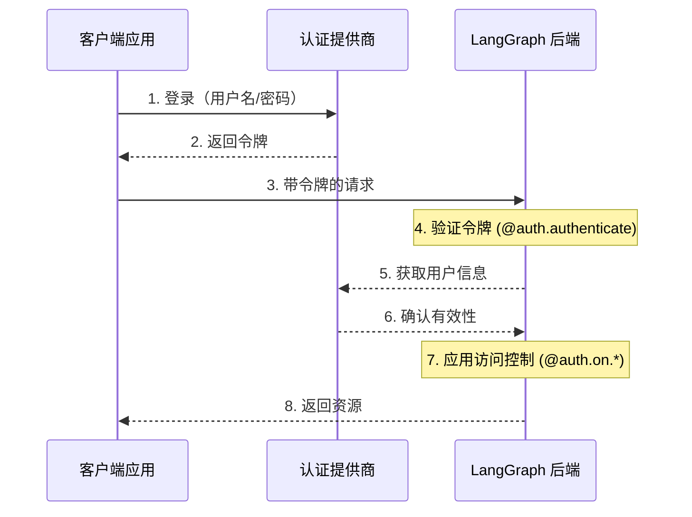
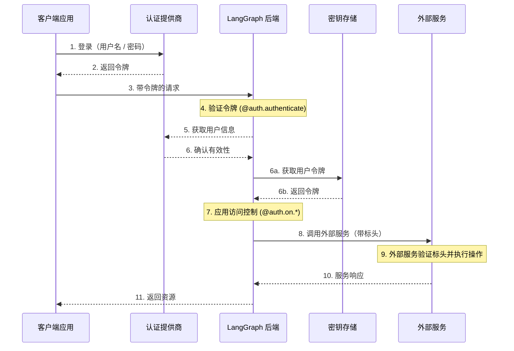

---
search:
  boost: 2
---

# 认证与访问控制

LangGraph Platform 提供了一个灵活的认证和授权系统，可以与大多数认证方案集成。

## 核心概念

### 认证 vs 授权

虽然这两个术语经常可以互换使用，但它们代表了不同的安全概念：

- [**认证**](#authentication) (“AuthN”) 验证**你是谁**。这作为中间件对每个请求运行。
- [**授权**](#authorization) (“AuthZ”) 决定**你能做什么**。这会为每个资源验证用户的权限和角色。

在 LangGraph Platform 中，认证由你的 [`@auth.authenticate`](../cloud/reference/sdk/python_sdk_ref.md#langgraph_sdk.auth.Auth.authenticate) 处理程序处理，授权由你的 [`@auth.on`](../cloud/reference/sdk/python_sdk_ref.md#langgraph_sdk.auth.Auth.on) 处理程序处理。

## 默认安全模型

LangGraph Platform 提供不同的安全默认设置：

### LangGraph Platform

- 默认使用 LangSmith API 密钥
- 需要在 `x-api-key` 标头中提供有效的 API 密钥
- 可通过你的认证处理程序进行自定义

!!! note "自定义认证"
    LangGraph Platform 的所有计划都**支持**自定义认证。

### 自托管

- 无默认认证
- 可以完全灵活地实现你的安全模型
- 你控制认证和授权的所有方面

!!! note "自定义认证"
    自托管的企业版部署**支持**自定义认证。
    独立容器（Lite）部署默认不支持自定义认证。

## 系统架构

典型的认证设置涉及三个主要组件：

1. **认证提供商**（身份提供商/IdP）

    * 管理用户身份和凭证的专用服务
    * 处理用户注册、登录、密码重置等
    * 在成功认证后颁发令牌（JWT、会话令牌等）
    * 示例：Auth0、Supabase Auth、Okta 或你自己的认证服务器

2. **LangGraph 后端**（资源服务器）

    * 包含业务逻辑和受保护资源的 LangGraph 应用程序
    * 使用认证提供商验证令牌
    * 基于用户身份和权限强制执行访问控制
    * 不直接存储用户凭据

3. **客户端应用程序**（前端）

    * Web 应用、移动应用或 API 客户端
    * 收集敏感的用户凭证并发送到认证提供商
    * 从认证提供商接收令牌
    * 将这些令牌包含在发送到 LangGraph 后端的请求中

以下是这些组件通常如何交互：



LangGraph 中的 [`@auth.authenticate`](../cloud/reference/sdk/python_sdk_ref.md#langgraph_sdk.auth.Auth.authenticate) 处理程序负责步骤 4-6，而 [`@auth.on`](../cloud/reference/sdk/python_sdk_ref.md#langgraph_sdk.auth.Auth.on) 处理程序则实现步骤 7。

## 认证

LangGraph 中的认证作为中间件对每个请求运行。你的 [`@auth.authenticate`](../cloud/reference/sdk/python_sdk_ref.md#langgraph_sdk.auth.Auth.authenticate) 处理程序会接收请求信息，并且应该：

1. 验证凭据
2. 如果凭据有效，则返回包含用户身份和用户信息的 [用户信息](../cloud/reference/sdk/python_sdk_ref.md#langgraph_sdk.auth.types.MinimalUserDict)
3. 如果凭据无效，则引发 [HTTP 异常](../cloud/reference/sdk/python_sdk_ref.md#langgraph_sdk.auth.exceptions.HTTPException) 或 AssertionError

```python
from langgraph_sdk import Auth

auth = Auth()

@auth.authenticate
async def authenticate(headers: dict) -> Auth.types.MinimalUserDict:
    # 验证凭据（例如，API Key、JWT 令牌）
    api_key = headers.get("x-api-key")
    if not api_key or not is_valid_key(api_key):
        raise Auth.exceptions.HTTPException(
            status_code=401,
            detail="无效的 API 密钥"
        )

    # 返回用户信息 - 只需要 identity 和 is_authenticated
    # 添加你需要的用于授权的任何额外字段
    return {
        "identity": "user-123",        # 必需：唯一用户标识符
        "is_authenticated": True,      # 可选：默认假定为 True
        "permissions": ["read", "write"] # 可选：用于基于权限的认证
        # 如果你想实现其他认证模式，可以添加更多自定义字段
        "role": "admin",
        "org_id": "org-456"

    }
```

返回的用户信息可在以下位置获取：

- 在授权处理程序中通过 [`ctx.user`](../cloud/reference/sdk/python_sdk_ref.md#langgraph_sdk.auth.types.AuthContext) 访问
- 在你的应用程序中通过 `config["configuration"]["langgraph_auth_user"]` 访问

??? tip "支持的参数"

    [`@auth.authenticate`](../cloud/reference/sdk/python_sdk_ref.md#langgraph_sdk.auth.Auth.authenticate) 处理程序可以通过名称接受以下任何参数：

    * request (Request): 原始 ASGI 请求对象
    * body (dict): 解析后的请求正文
    * path (str): 请求路径，例如 "/threads/abcd-1234-abcd-1234/runs/abcd-1234-abcd-1234/stream"
    * method (str): HTTP 方法，例如 "GET"
    * path_params (dict[str, str]): URL 路径参数，例如 {"thread_id": "abcd-1234-abcd-1234", "run_id": "abcd-1234-abcd-1234"}
    * query_params (dict[str, str]): URL 查询参数，例如 {"stream": "true"}
    * headers (dict[bytes, bytes]): 请求头
    * authorization (str | None): Authorization 标头值（例如 "Bearer <token>"）
    
    在我们许多教程中，为了简洁起见，我们只展示 "authorization" 参数，但你可以选择接受更多信息来根据需要实现自定义认证方案。

### Agent 认证

自定义认证允许委托访问。你在 `@auth.authenticate` 中返回的值会被添加到运行上下文中，为代理提供用户范围的凭据，使它们能够代表用户访问资源。



认证后，平台会创建一个特殊的配置对象，该对象通过可配置上下文传递给你的图表和所有节点。
此对象包含当前用户信息，包括你从 [`@auth.authenticate`](../cloud/reference/sdk/python_sdk_ref.md#langgraph_sdk.auth.Auth.authenticate) 处理程序返回的任何自定义字段。

要使代理能够代表用户执行操作，请使用[自定义认证中间件](../how-tos/auth/custom_auth.md)。这将允许代理代表用户与 MCP 服务器、外部数据库甚至其他代理等外部系统进行交互。有关更多信息，请参阅[使用自定义认证](../how-tos/auth/custom_auth.md#enable-agent-authentication)指南。

### 使用 MCP 进行 Agent 认证

有关如何将代理认证到 MCP 服务器的信息，请参阅[MCP概念指南](../concepts/mcp.md)。

## 授权

认证后，LangGraph 会调用你的 [`@auth.on`](../cloud/reference/sdk/python_sdk_ref.md#langgraph_sdk.auth.Auth.on) 处理程序来控制对特定资源的访问（例如，threads、assistants、crons）。这些处理程序可以：

1.  通过直接修改 `value["metadata"]` 字典来向资源创建过程中添加元数据。有关每个操作的 value 可以采取的类型列表，请参阅[支持的操作表](#supported-actions)。
2.  在搜索/列表或读取操作期间通过返回[筛选器字典](#filter-operations)来按元数据筛选资源。
3.  如果拒绝访问，则引发 HTTP 异常。

如果你只想实现简单的用户范围的访问控制，可以为所有资源和操作使用单个 [`@auth.on`](../cloud/reference/sdk/python_sdk_ref.md#langgraph_sdk.auth.Auth.on) 处理程序。如果你希望根据资源和操作具有不同的控制，可以使用[特定资源的处理程序](#resource-specific-handlers)。有关支持访问控制的资源的完整列表，请参阅[支持的资源](#supported-resources)部分。

```python
@auth.on
async def add_owner(
    ctx: Auth.types.AuthContext,
    value: dict  # 发送到此访问方法的载荷
) -> dict:  # 返回一个限制对资源访问的筛选器字典
    """授权对 threads、runs、crons 和 assistants 的所有访问。

    此处理程序有两个作用：
        - 向资源元数据添加一个值（以持久化与资源关联，以便稍后可以筛选）
        - 返回一个筛选器（以限制对现有资源的访问）

    Args:
        ctx: 包含用户信息、权限、路径和
        value: 发送到端点的请求载荷。对于创建操作，这包含了资源参数。对于读取操作，这包含了正在访问的资源。

    Returns:
        一个 LangGraph 用于限制对资源访问的筛选器字典。
        有关支持的操作符，请参阅[筛选器操作](#filter-operations)。
    """
    # 创建筛选器以仅限制对该用户资源的访问
    filters = {"owner": ctx.user.identity}

    # 获取或创建载荷中的元数据字典
    # 这是存储资源持久信息的地方
    metadata = value.setdefault("metadata", {})

    # 添加 owner 到元数据 - 如果这是一个创建或更新操作，
    # 此信息将与资源一起保存
    # 因此，我们可以在读取操作中按此进行筛选
    metadata.update(filters)

    # 返回筛选器以限制访问
    # 这些筛选器应用于所有操作（创建、读取、更新、搜索等）
    # 以确保用户只能访问自己的资源
    return filters
```

### 特定资源的处理程序 {#resource-specific-handlers}

你可以通过将资源和操作名称与 [`@auth.on`](../cloud/reference/sdk/python_sdk_ref.md#langgraph_sdk.auth.Auth.on) 装饰器链接起来，来为特定的资源和操作注册处理程序。
当发出请求时，最匹配该资源和操作的最具体的处理程序将被调用。下面是如何为特定资源和操作注册处理程序的示例。对于以下设置：

1.  已认证的用户可以创建 threads、读取 threads，并在 threads 上创建 runs。
2.  只有具有“assistants:create”权限的用户才能创建新的 assistants。
3.  所有其他端点（例如，删除 assistant、crons、store）对所有用户都禁用。

!!! tip "支持的处理程序"

    有关支持的资源和操作的完整列表，请参阅下面的[支持的资源](#supported-resources)部分。

```python
# 通用/全局处理程序会捕获未被更具体处理程序处理的调用
@auth.on
async def reject_unhandled_requests(ctx: Auth.types.AuthContext, value: Any) -> False:
    print(f"Request to {ctx.path} by {ctx.user.identity}")
    raise Auth.exceptions.HTTPException(
        status_code=403,
        detail="禁止访问"
    )

# 匹配“thread”资源和所有操作——创建、读取、更新、删除、搜索
# 由于这比通用的 @auth.on 处理程序更具体，它将优先于所有 thread 操作的通用处理程序
@auth.on.threads
async def on_thread_create(
    ctx: Auth.types.AuthContext,
    value: Auth.types.threads.create.value
):
    if "write" not in ctx.permissions:
        raise Auth.exceptions.HTTPException(
            status_code=403,
            detail="用户缺乏所需权限。"
        )
    # 在创建的 thread 上设置元数据
    # 将确保资源包含一个“owner”字段
    # 然后任何时候用户尝试访问该 thread 或其中的 runs，
    # 我们都可以按所有者进行筛选
    metadata = value.setdefault("metadata", {})
    metadata["owner"] = ctx.user.identity
    return {"owner": ctx.user.identity}

# Thread 创建。这只会匹配 thread 创建操作
# 由于这比通用的 @auth.on 处理程序和 @auth.on.threads 处理程序更具体，
# 它将优先于所有 thread 资源的“创建”操作
@auth.on.threads.create
async def on_thread_create(
    ctx: Auth.types.AuthContext,
    value: Auth.types.threads.create.value
):
    # 在创建的 thread 上设置元数据
    # 将确保资源包含一个“owner”字段
    # 然后任何时候用户尝试访问该 thread 或其中的 runs，
    # 我们都可以按所有者进行筛选
    metadata = value.setdefault("metadata", {})
    metadata["owner"] = ctx.user.identity
    return {"owner": ctx.user.identity}

# 读取 thread。由于这比通用的 @auth.on 处理程序和 @auth.on.threads 处理程序更具体，
# 它将优先于 thread 资源的任何“读取”操作
@auth.on.threads.read
async def on_thread_read(
    ctx: Auth.types.AuthContext,
    value: Auth.types.threads.read.value
):
    # 由于我们正在读取（而不是创建）一个 thread，
    # 我们不需要设置元数据。我们只需要
    # 返回一个筛选器来确保用户只能查看自己的 threads
    return {"owner": ctx.user.identity}

# Run 创建、流式传输、更新等。
# 这将优先于通用的 @auth.on 处理程序和 @auth.on.threads 处理程序
@auth.on.threads.create_run
async def on_run_create(
    ctx: Auth.types.AuthContext,
    value: Auth.types.threads.create_run.value
):
    metadata = value.setdefault("metadata", {})
    metadata["owner"] = ctx.user.identity
    # 继承 thread 的访问控制
    return {"owner": ctx.user.identity}

# Assistant 创建
@auth.on.assistants.create
async def on_assistant_create(
    ctx: Auth.types.AuthContext,
    value: Auth.types.assistants.create.value
):
    if "assistants:create" not in ctx.permissions:
        raise Auth.exceptions.HTTPException(
            status_code=403,
            detail="用户缺乏所需权限。"
        )
```

你会注意到我们在上面的示例中混合使用了全局和特定于资源的处理程序。由于每个请求都由最具体匹配的处理程序处理，因此创建 `thread` 的请求将匹配 `on_thread_create` 处理程序，但*不*匹配 `reject_unhandled_requests` 处理程序。然而，更新 thread 的请求将由全局处理程序处理，因为我们没有该资源和操作的更具体处理程序。

### 筛选器操作 {#filter-operations}

授权处理程序可以返回 `None`、布尔值或筛选器字典。
- `None` 和 `True` 表示“授权访问所有底层资源”
- `False` 表示“拒绝访问所有底层资源（引发 403 异常）”
- 元数据筛选器字典将限制对资源的访问

筛选器字典是密钥匹配资源元数据的字典。它支持三个操作符：

- 默认值是精确匹配的简写，或下面的“$eq”。例如，`{"owner": user_id}` 将只包括包含 `{"owner": user_id}` 元数据的资源。
- `$eq`: 精确匹配（例如，`{"owner": {"$eq": user_id}}`）——这等同于上面的简写 `{ "owner": user_id }`
- `$contains`: 列表成员（例如，`{"allowed_users": {"$contains": user_id}}`）此处的值必须是列表中的一个元素。存储资源中的元数据必须是列表/容器类型。

具有多个键的字典使用逻辑“AND”筛选器进行处理。例如，`{"owner": org_id, "allowed_users": {"$contains": user_id}}` 将只匹配元数据中“owner”为 `org_id` 且其“allowed_users”列表包含 `user_id` 的资源。
有关更多信息，请参阅这里的[参考](../cloud/reference/sdk/python_sdk_ref.md#langgraph_sdk.auth.types.FilterType)。

## 常见访问模式

以下是一些典型的授权模式：

### 单一所有者资源

这种常见模式允许你将所有 threads、assistants、crons 和 runs 范围限定为单个用户。这对于常规的单用户用例（如普通聊天机器人风格的应用）非常有用。

```python
@auth.on
async def owner_only(ctx: Auth.types.AuthContext, value: dict):
    metadata = value.setdefault("metadata", {})
    metadata["owner"] = ctx.user.identity
    return {"owner": ctx.user.identity}
```

### 基于权限的访问

这种模式允许你基于**权限**控制访问。如果你希望某些角色拥有更广泛或更严格的资源访问权限，这将非常有用。

```python
# 在你的认证处理程序中：
@auth.authenticate
async def authenticate(headers: dict) -> Auth.types.MinimalUserDict:
    ...
    return {
        "identity": "user-123",
        "is_authenticated": True,
        "permissions": ["threads:write", "threads:read"]  # 在认证中定义权限
    }

def _default(ctx: Auth.types.AuthContext, value: dict):
    metadata = value.setdefault("metadata", {})
    metadata["owner"] = ctx.user.identity
    return {"owner": ctx.user.identity}

@auth.on.threads.create
async def create_thread(ctx: Auth.types.AuthContext, value: dict):
    if "threads:write" not in ctx.permissions:
        raise Auth.exceptions.HTTPException(
            status_code=403,
            detail="未授权"
        )
    return _default(ctx, value)


@auth.on.threads.read
async def rbac_create(ctx: Auth.types.AuthContext, value: dict):
    if "threads:read" not in ctx.permissions and "threads:write" not in ctx.permissions:
        raise Auth.exceptions.HTTPException(
            status_code=403,
            detail="未授权"
        )
    return _default(ctx, value)
```

## 支持的资源

LangGraph 提供三个级别的授权处理程序，从最笼统到最具体：

1.  **全局处理程序** (`@auth.on`): 匹配所有资源和操作
2.  **资源处理程序**（例如，`@auth.on.threads`、`@auth.on.assistants`、`@auth.on.crons`）：匹配特定资源的所有操作
3.  **操作处理程序**（例如，`@auth.on.threads.create`、`@auth.on.threads.read`）：匹配特定资源上的特定操作

将使用最具体匹配的处理程序。例如，对于 thread 创建，`@auth.on.threads.create` 优先于 `@auth.on.threads`。
如果注册了更具体处理程序，则该资源和操作的更通用处理程序将不会被调用。

???+ tip "类型安全"
    每个处理程序都为其 `value` 参数提供了类型提示，位于 `Auth.types.on.<resource>.<action>.value`。例如：
    ```python
    @auth.on.threads.create
    async def on_thread_create(
        ctx: Auth.types.AuthContext,
        value: Auth.types.on.threads.create.value  # thread 创建的特定类型
    ):
        ...
    
    @auth.on.threads
    async def on_threads(
        ctx: Auth.types.AuthContext,
        value: Auth.types.on.threads.value  # 所有 thread 操作的联合类型
    ):
        ...
    
    @auth.on
    async def on_all(
        ctx: Auth.types.AuthContext,
        value: dict  # 所有可能操作的联合类型
    ):
        ...
    ```
    更具体处理程序提供更好的类型提示，因为它们处理的操作类型更少。

#### 支持的操作和类型 {#supported-actions}
以下是所有支持的操作处理程序：

| 资源 | 处理程序 | 描述 | 值类型 |
|----------|---------|-------------|------------|
| **Threads** | `@auth.on.threads.create` | Thread 创建 | [`ThreadsCreate`](../cloud/reference/sdk/python_sdk_ref.md#langgraph_sdk.auth.types.ThreadsCreate) |
| | `@auth.on.threads.read` | Thread 检索 | [`ThreadsRead`](../cloud/reference/sdk/python_sdk_ref.md#langgraph_sdk.auth.types.ThreadsRead) |
| | `@auth.on.threads.update` | Thread 更新 | [`ThreadsUpdate`](../cloud/reference/sdk/python_sdk_ref.md#langgraph_sdk.auth.types.ThreadsUpdate) |
| | `@auth.on.threads.delete` | Thread 删除 | [`ThreadsDelete`](../cloud/reference/sdk/python_sdk_ref.md#langgraph_sdk.auth.types.ThreadsDelete) |
| | `@auth.on.threads.search` | 列出 threads | [`ThreadsSearch`](../cloud/reference/sdk/python_sdk_ref.md#langgraph_sdk.auth.types.ThreadsSearch) |
| | `@auth.on.threads.create_run` | 创建或更新 run | [`RunsCreate`](../cloud/reference/sdk/python_sdk_ref.md#langgraph_sdk.auth.types.RunsCreate) |
| **Assistants** | `@auth.on.assistants.create` | Assistant 创建 | [`AssistantsCreate`](../cloud/reference/sdk/python_sdk_ref.md#langgraph_sdk.auth.types.AssistantsCreate) |
| | `@auth.on.assistants.read` | Assistant 检索 | [`AssistantsRead`](../cloud/reference/sdk/python_sdk_ref.md#langgraph_sdk.auth.types.AssistantsRead) |
| | `@auth.on.assistants.update` | Assistant 更新 | [`AssistantsUpdate`](../cloud/reference/sdk/python_sdk_ref.md#langgraph_sdk.auth.types.AssistantsUpdate) |
| | `@auth.on.assistants.delete` | Assistant 删除 | [`AssistantsDelete`](../cloud/reference/sdk/python_sdk_ref.md#langgraph_sdk.auth.types.AssistantsDelete) |
| | `@auth.on.assistants.search` | 列出 assistants | [`AssistantsSearch`](../cloud/reference/sdk/python_sdk_ref.md#langgraph_sdk.auth.types.AssistantsSearch) |
| **Crons** | `@auth.on.crons.create` | Cron Job 创建 | [`CronsCreate`](../cloud/reference/sdk/python_sdk_ref.md#langgraph_sdk.auth.types.CronsCreate) |
| | `@auth.on.crons.read` | Cron Job 检索 | [`CronsRead`](../cloud/reference/sdk/python_sdk_ref.md#langgraph_sdk.auth.types.CronsRead) |
| | `@auth.on.crons.update` | Cron Job 更新 | [`CronsUpdate`](../cloud/reference/sdk/python_sdk_ref.md#langgraph_sdk.auth.types.CronsUpdate) |
| | `@auth.on.crons.delete` | Cron Job 删除 | [`CronsDelete`](../cloud/reference/sdk/python_sdk_ref.md#langgraph_sdk.auth.types.CronsDelete) |
| | `@auth.on.crons.search` | 列出 cron jobs | [`CronsSearch`](../cloud/reference/sdk/python_sdk_ref.md#langgraph_sdk.auth.types.CronsSearch) |

???+ note "关于 Runs"

    Runs 默认与其父 thread 范围限定以进行访问控制。这意味着权限通常从 thread 继承，以反映数据模型的对话性。除创建外，所有 run 操作（读取、列出）均由 thread 的处理程序控制。
    有一个特定的 `create_run` 处理程序用于创建新的 runs，因为它有更多你可以在处理程序中查看的参数。


## 后续步骤

有关实现细节：

- 查看关于[设置认证](../tutorials/auth/getting_started.md)的入门教程
- 查看关于实现[自定义认证处理程序](../how-tos/auth/custom_auth.md)的操作指南