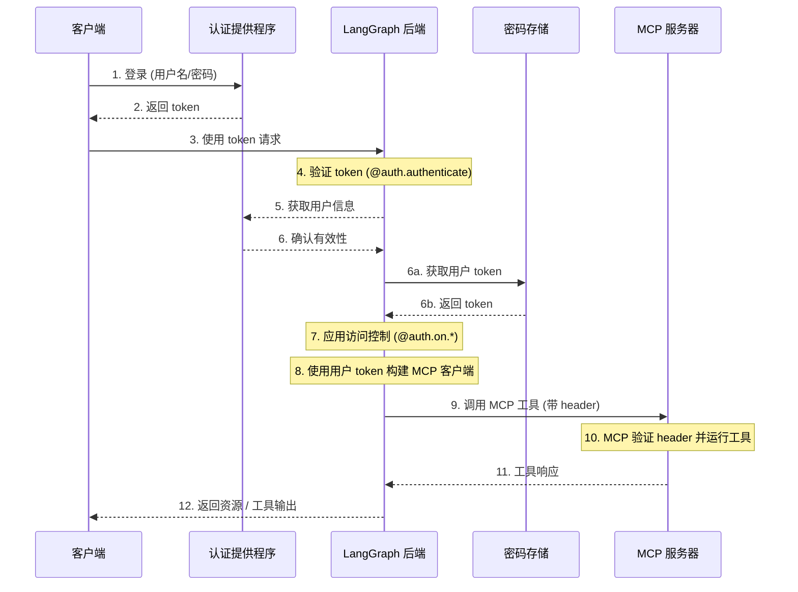

# MCP

[模型上下文协议 (MCP)](https://modelcontextprotocol.io/introduction) 是一个开放协议，用于标准化应用程序如何向语言模型提供工具和上下文。LangGraph 代理可以通过 `langchain-mcp-adapters` 库使用 MCP 服务器上定义的工具。


安装 `langchain-mcp-adapters` 库即可在 LangGraph 中使用 MCP 工具：

```bash
pip install langchain-mcp-adapters
```

## 认证到 MCP 服务器

您可以设置 [自定义认证中间件](../how-tos/auth/custom_auth.md)，以通过 MCP 服务器对用户进行身份验证，从而在您的 LangGraph Platform 部署中访问用户范围的工具。

!!! note
    自定义认证是 LangGraph Platform 的一项功能。

此流程的示例架构：



有关更多信息，请参阅 [LangGraph Server 中的 MCP 端点](../concepts/server-mcp.md#use-user-scoped-mcp-tools-in-your-deployment)。