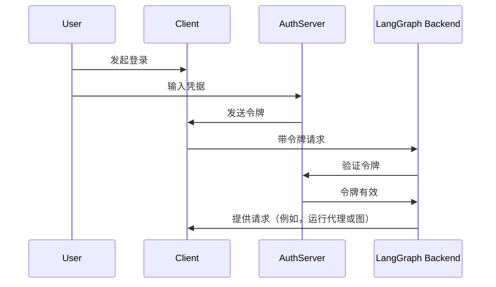

# 连接认证提供商

在[上一教程](resource_auth.md)中，您添加了[资源授权](../../tutorials/auth/resource_auth.md)来为用户提供私有对话。但是，您仍然使用硬编码的令牌进行身份验证，这是不安全的。现在，您将使用[OAuth2](../auth/getting_started.md)通过真实用户账户替换这些令牌。

您将保留相同的 [`Auth`](../../cloud/reference/sdk/python_sdk_ref.md#langgraph_sdk.auth.Auth) 对象和[资源级别访问控制](../../concepts/auth.md#single-owner-resources)，但会将身份验证升级为使用 Supabase 作为您的身份提供商。虽然本教程使用了 Supabase，但这些概念适用于任何 OAuth2 提供商。您将学习如何：

1. 替换测试令牌为真实的 JWT 令牌
2. 集成 OAuth2 提供商以实现安全的身份验证
3. 在维护现有授权逻辑的同时处理用户会话和元数据

## 背景

OAuth2 主要涉及三个角色：

1. **认证服务器**：身份提供商（例如 Supabase、Auth0、Google），负责用户认证和颁发令牌
2. **应用程序后端**：您的 LangGraph 应用程序。它负责验证令牌并提供受保护的资源（对话数据）
3. **客户端应用程序**：用户与您的服务进行交互的 Web 或移动应用程序

标准的 OAuth2 流程大致如下：




## 先决条件

在开始本教程之前，请确保您已：

- [第二个教程](resource_auth.md)中的机器人可以无误运行。
- 一个[Supabase 项目](https://supabase.com/dashboard)以使用其认证服务器。


## 1. 安装依赖项

安装所需的依赖项。在您的 `custom-auth` 目录中开始，并确保已安装 `langgraph-cli`：

```bash
cd custom-auth
pip install -U "langgraph-cli[inmem]"
```

## 2. 设置认证提供商 {#setup-auth-provider}

接下来，获取您的认证服务器的 URL 和用于认证的私钥。
由于您将使用 Supabase，因此可以在 Supabase 仪表板中执行此操作：

1. 在左侧边栏中，单击 t "项目设置"，然后单击 "API"
1. 将您的项目 URL 复制并添加到您的 `.env` 文件中

    ```shell
    echo "SUPABASE_URL=your-project-url" >> .env
    ```
1. 将您的服务角色密钥复制并添加到您的 `.env` 文件中：

    ```shell
    echo "SUPABASE_SERVICE_KEY=your-service-role-key" >> .env
    ```
1. 复制您的 "anon public" 密钥并记下来。稍后设置客户端代码时将使用它。

    ```bash
    SUPABASE_URL=your-project-url
    SUPABASE_SERVICE_KEY=your-service-role-key
    ```

## 3. 实现令牌验证

在之前的教程中，您使用了 [`Auth`](../../cloud/reference/sdk/python_sdk_ref.md#langgraph_sdk.auth.Auth) 对象来[验证硬编码的令牌](getting_started.md)和[添加资源所有权](resource_auth.md)。

现在，您将升级您的身份验证以从 Supabase 验证真实的 JWT 令牌。主要更改将全部在 [`@auth.authenticate`](../../cloud/reference/sdk/python_sdk_ref.md#langgraph_sdk.auth.Auth.authenticate) 装饰的函数中：

- 您将向 Supabase 发送 HTTP 请求来验证令牌，而不是与硬编码的令牌列表进行检查。
- 您将从已验证的令牌中提取真实的用户信息（ID、电子邮件）。
- 现有的资源授权逻辑保持不变。

更新 `src/security/auth.py` 以实现此目的：

```python hl_lines="8-9 20-30" title="src/security/auth.py"
import os
import httpx
from langgraph_sdk import Auth

auth = Auth()

# 这将从您上面创建的 `.env` 文件加载
SUPABASE_URL = os.environ["SUPABASE_URL"]
SUPABASE_SERVICE_KEY = os.environ["SUPABASE_SERVICE_KEY"]


@auth.authenticate
async def get_current_user(authorization: str | None):
    """验证 JWT 令牌并提取用户信息。"""
    assert authorization
    scheme, token = authorization.split()
    assert scheme.lower() == "bearer"

    try:
        # 使用认证提供商验证令牌
        async with httpx.AsyncClient() as client:
            response = await client.get(
                f"{SUPABASE_URL}/auth/v1/user",
                headers={
                    "Authorization": authorization,
                    "apiKey": SUPABASE_SERVICE_KEY,
                },
            )
            assert response.status_code == 200
            user = response.json()
            return {
                "identity": user["id"],  # 唯一用户标识符
                "email": user["email"],
                "is_authenticated": True,
            }
    except Exception as e:
        raise Auth.exceptions.HTTPException(status_code=401, detail=str(e))

# ... 其余部分与之前相同

# 保留我们上一个教程中的资源授权
@auth.on
async def add_owner(ctx, value):
    """通过资源元数据将资源私有化给其创建者。"""
    filters = {"owner": ctx.user.identity}
    metadata = value.setdefault("metadata", {})
    metadata.update(filters)
    return filters
```

最重要的变化是我们现在使用真实的认证服务器来验证令牌。我们的认证处理程序拥有 Supabase 项目的私钥，我们可以使用它来验证用户的令牌并提取他们的信息。

## 4. 测试认证流程

让我们测试新的认证流程。您可以在文件或笔记本中运行以下代码。您需要提供：

- 有效的电子邮件地址
- Supabase 项目 URL（来自[上方](#setup-auth-provider)）
- Supabase anon **公共密钥**（也来自[上方](#setup-auth-provider)）

```python
import os
import httpx
from getpass import getpass
from langgraph_sdk import get_client


# 从命令行获取电子邮件
email = getpass("请输入您的电子邮件：")
base_email = email.split("@")
password = "secure-password"  # 更改此项
email1 = f"{base_email[0]}+1@{base_email[1]}"
email2 = f"{base_email[0]}+2@{base_email[1]}"

SUPABASE_URL = os.environ.get("SUPABASE_URL")
if not SUPABASE_URL:
    SUPABASE_URL = getpass("请输入您的 Supabase 项目 URL：")

# 这是您的公共 anon 密钥（客户端使用它是安全的）
# 不要将其误认为是秘密服务角色密钥
SUPABASE_ANON_KEY = os.environ.get("SUPABASE_ANON_KEY")
if not SUPABASE_ANON_KEY:
    SUPABASE_ANON_KEY = getpass("请输入您的公共 Supabase anon 密钥：")


async def sign_up(email: str, password: str):
    """创建新的用户账户。"""
    async with httpx.AsyncClient() as client:
        response = await client.post(
            f"{SUPABASE_URL}/auth/v1/signup",
            json={"email": email, "password": password},
            headers={"apiKey": SUPABASE_ANON_KEY},
        )
        assert response.status_code == 200
        return response.json()

# 创建两个测试用户
print(f"正在创建测试用户：{email1} 和 {email2}")
await sign_up(email1, password)
await sign_up(email2, password)
```

⚠️ 在继续之前：检查您的电子邮件并点击两个确认链接。Supabase 将拒绝 `/login` 请求，直到您确认了用户的电子邮件。

现在测试用户是否只能查看自己的数据。在继续之前，请确保服务器正在运行（运行 `langgraph dev`）。以下代码段需要您在[设置认证提供商](#setup-auth-provider)时从 Supabase 仪表板复制的 "anon public" 密钥。

```python
async def login(email: str, password: str):
    """获取现有用户的访问令牌。"""
    async with httpx.AsyncClient() as client:
        response = await client.post(
            f"{SUPABASE_URL}/auth/v1/token?grant_type=password",
            json={
                "email": email,
                "password": password
            },
            headers={
                "apikey": SUPABASE_ANON_KEY,
                "Content-Type": "application/json"
            },
        )
        assert response.status_code == 200
        return response.json()["access_token"]


# 登录用户 1
user1_token = await login(email1, password)
user1_client = get_client(
    url="http://localhost:2024", headers={"Authorization": f"Bearer {user1_token}"}
)

# 创建一个用户 1 的线程
thread = await user1_client.threads.create()
print(f"✅ 用户 1 创建了线程：{thread['thread_id']}")

# 尝试在没有令牌的情况下访问
unauthenticated_client = get_client(url="http://localhost:2024")
try:
    await unauthenticated_client.threads.create()
    print("❌ 未经身份验证的访问应该失败！")
except Exception as e:
    print("✅ 未经身份验证的访问被阻止：", e)

# 尝试作为用户 2 访问用户 1 的线程
user2_token = await login(email2, password)
user2_client = get_client(
    url="http://localhost:2024", headers={"Authorization": f"Bearer {user2_token}"}
)

try:
    await user2_client.threads.get(thread["thread_id"])
    print("❌ 用户 2 不应该看到用户 1 的线程！")
except Exception as e:
    print("✅ 用户 2 被阻止访问用户 1 的线程：", e)
```
输出应如下所示：

```shell
✅ 用户 1 创建了线程：d6af3754-95df-4176-aa10-dbd8dca40f1a
✅ 未经身份验证的访问被阻止：Client error '403 Forbidden' for url 'http://localhost:2024/threads'
✅ 用户 2 被阻止访问用户 1 的线程：Client error '404 Not Found' for url 'http://localhost:2024/threads/d6af3754-95df-4176-aa10-dbd8dca40f1a'
```

您的身份验证和授权协同工作：

1. 用户必须登录才能访问机器人
2. 每个用户只能看到自己的线程

所有用户都由 Supabase 认证提供商管理，因此您无需实现任何额外的用户管理逻辑。

## 下一步

您已成功为您的 LangGraph 应用程序构建了一个生产级的认证系统！让我们回顾一下您已经完成的工作：

1. 设置认证提供商（本例中为 Supabase）
2. 添加了具有电子邮件/密码认证的真实用户账户
3. 将 JWT 令牌验证集成到您的 LangGraph 服务器中
4. 实现了适当的授权，以确保用户只能访问他们自己的数据
5. 创建了一个已准备好处理您下一个认证挑战的基础 🚀

现在您有了生产认证，请考虑：

1. 使用您喜欢的框架构建 Web UI（请参阅[自定义认证](https://github.com/langchain-ai/custom-auth)模板以获取示例）
2. 通过[认证概念指南](../../concepts/auth.md)了解认证和授权的其他方面。
3. 在阅读[参考文档](../../cloud/reference/sdk/python_sdk_ref.md#langgraph_sdk.auth.Auth)后进一步自定义您的处理程序和设置。