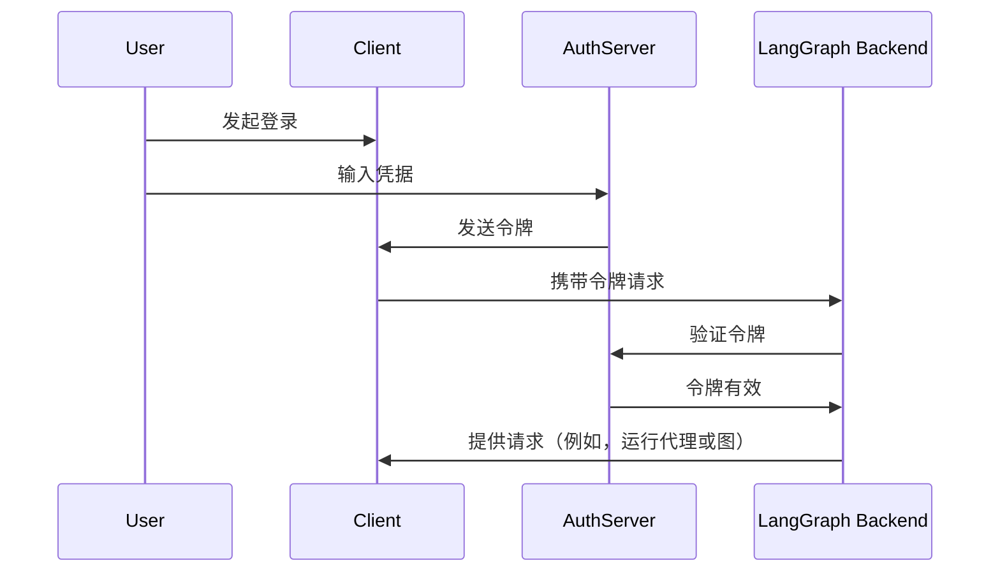

# 连接认证提供商

在[上一教程](resource_auth.md)中，你添加了[资源授权](../../tutorials/auth/resource_auth.md)以允许用户进行私有对话。然而，你仍然使用硬编码的令牌进行身份验证，这并不安全。现在，你将使用 [OAuth2](../auth/getting_started.md) 来替换这些令牌，改为使用真实的用户账户。

:::python
你将保留相同的 [`Auth`](../../cloud/reference/sdk/python_sdk_ref.md#langgraph_sdk.auth.Auth) 对象和[资源级别访问控制](../../concepts/auth.md#single-owner-resources)，但将身份验证升级为使用 Supabase 作为你的身份提供商。虽然本教程使用了 Supabase，但这些概念适用于任何 OAuth2 提供商。你将学到如何：
:::

:::js
你将保留相同的 [`Auth`](../../cloud/reference/sdk/typescript_sdk_ref.md#auth) 对象和[资源级别访问控制](../../concepts/auth.md#single-owner-resources)，但将身份验证升级为使用 Supabase 作为你的身份提供商。虽然本教程使用了 Supabase，但这些概念适用于任何 OAuth2 提供商。你将学到如何：
:::

1.  替换测试令牌为真实的 JWT 令牌
2.  集成 OAuth2 提供商实现安全的用户身份验证
3.  在保持现有授权逻辑的同时，处理用户会话和元数据

## 背景

OAuth2 主要涉及三个角色：

1.  **授权服务器**：处理用户身份验证并颁发令牌的身份提供商（例如，Supabase、Auth0、Google）。
2.  **应用程序后端**：你的 LangGraph 应用程序。它会验证令牌并发放受保护的资源（对话数据）。
3.  **客户端应用程序**：用户与你的服务交互的 Web 或移动应用程序。

标准的 OAuth2 流程大致如下：



## 先决条件

在开始本教程之前，请确保你已：

-   [运行了第二教程的机器人](resource_auth.md)，并且没有错误。
-   拥有一个 [Supabase 项目](https://supabase.com/dashboard) 作为你的身份验证服务器。

## 1. 安装依赖

安装所需的依赖项。在你的 `custom-auth` 目录下开始，并确保已安装 `langgraph-cli`：

:::python

```bash
cd custom-auth
pip install -U "langgraph-cli[inmem]"
```

:::

:::js

```bash
cd custom-auth
npm install -g @langchain/langgraph-cli
```

:::

## 2. 设置认证提供商 {#setup-auth-provider}

接下来，获取你的认证服务器的 URL 和用于身份验证的私钥。
由于你将使用 Supabase，你可以在 Supabase 控制台中完成此操作：

1.  在左侧边栏中，点击“⚙️ 项目设置”，然后点击“API”。
2.  将你的项目 URL 复制并添加到你的 `.env` 文件中。

    ```shell
    echo "SUPABASE_URL=your-project-url" >> .env
    ```

3.  复制你的服务角色密钥并将其添加到你的 `.env` 文件中：

    ```shell
    echo "SUPABASE_SERVICE_KEY=your-service-role-key" >> .env
    ```

4.  复制你的“匿名公开”密钥并记下。稍后在设置客户端代码时会用到它。

    ```bash
    SUPABASE_URL=your-project-url
    SUPABASE_SERVICE_KEY=your-service-role-key
    ```

## 3. 实现令牌验证

:::python
在之前的教程中，你使用了 [`Auth`](../../cloud/reference/sdk/python_sdk_ref.md#langgraph_sdk.auth.Auth) 对象来[验证硬编码的令牌](getting_started.md)并[添加资源所有权](resource_auth.md)。

现在，你将升级你的身份验证，以验证来自 Supabase 的真实 JWT 令牌。主要的更改都将出现在 [`@auth.authenticate`](../../cloud/reference/sdk/python_sdk_ref.md#langgraph_sdk.auth.Auth.authenticate) 装饰的函数中：
:::

:::js
在之前的教程中，你使用了 [`Auth`](../../cloud/reference/sdk/typescript_sdk_ref.md#auth) 对象来[验证硬编码的令牌](getting_started.md)和[添加资源所有权](resource_auth.md)。

现在，你将升级你的身份验证，以验证来自 Supabase 的真实 JWT 令牌。主要的更改都将出现在 [`auth.authenticate`](../../cloud/reference/sdk/typescript_sdk_ref.md#auth) 装饰的函数中：
:::

-   与检查硬编码的令牌列表不同，你将向 Supabase 发起 HTTP 请求来验证令牌。
-   你将从已验证的令牌中提取真实的用户信息（ID、电子邮件）。
-   现有的资源授权逻辑保持不变。

:::python
更新 `src/security/auth.py` 来实现这一点：

```python hl_lines="8-9 20-30" title="src/security/auth.py"
import os
import httpx
from langgraph_sdk import Auth

auth = Auth()

# 这将从你上面创建的 `.env` 文件加载
SUPABASE_URL = os.environ["SUPABASE_URL"]
SUPABASE_SERVICE_KEY = os.environ["SUPABASE_SERVICE_KEY"]


@auth.authenticate
async def get_current_user(authorization: str | None):
    """验证 JWT 令牌并提取用户信息。"""
    assert authorization
    scheme, token = authorization.split()
    assert scheme.lower() == "bearer"

    try:
        # 使用认证提供商验证令牌
        async with httpx.AsyncClient() as client:
            response = await client.get(
                f"{SUPABASE_URL}/auth/v1/user",
                headers={
                    "Authorization": authorization,
                    "apiKey": SUPABASE_SERVICE_KEY,
                },
            )
            assert response.status_code == 200
            user = response.json()
            return {
                "identity": user["id"],  # 唯一的用户标识符
                "email": user["email"],
                "is_authenticated": True,
            }
    except Exception as e:
        raise Auth.exceptions.HTTPException(status_code=401, detail=str(e))

# ... 其余部分与之前相同

# 保留我们上一个教程中的资源授权
@auth.on
async def add_owner(ctx, value):
    """使用资源元数据使资源对创建者私有。"""
    filters = {"owner": ctx.user.identity}
    metadata = value.setdefault("metadata", {})
    metadata.update(filters)
    return filters
```

:::

:::js
更新 `src/security/auth.ts` 来实现这一点：

```typescript hl_lines="1-2 9-10 21-31" title="src/security/auth.ts"
import { Auth } from "@langchain/langgraph-sdk";

// 这将从你上面创建的 `.env` 文件加载
const SUPABASE_URL = process.env.SUPABASE_URL;
const SUPABASE_SERVICE_KEY = process.env.SUPABASE_SERVICE_KEY;

const auth = new Auth()
  .authenticate(async (request) => {
    // 验证 JWT 令牌并提取用户信息。
    const apiKey = request.headers.get("x-api-key");
    if (!apiKey || !isValidKey(apiKey)) {
      throw new HTTPException(401, "Invalid API key");
    }

    const [scheme, token] = apiKey.split(" ");
    if (scheme.toLowerCase() !== "bearer") {
      throw new Error("Invalid authorization scheme");
    }

    try {
      // 使用认证提供商验证令牌
      const response = await fetch(`${SUPABASE_URL}/auth/v1/user`, {
        headers: {
          Authorization: authorization,
          apiKey: SUPABASE_SERVICE_KEY!,
        },
      });

      if (response.status !== 200) {
        throw new Error("Invalid token");
      }

      const user = await response.json();
      return {
        identity: user.id, // 唯一的用户标识符
        email: user.email,
        is_authenticated: true,
      };
    } catch (e) {
      throw new Auth.HTTPException(401, String(e));
    }
  })
  .on(async ({ user, value }) => {
    // 保留我们上一个教程中的资源授权
    // 使用资源元数据使资源对创建者私有。
    const filters = { owner: user.identity };
    const metadata = value.metadata || {};
    Object.assign(metadata, filters);
    value.metadata = metadata;
    return filters;
  });

export { auth };
```

:::

最显著的变化是我们现在使用真正的身份验证服务器来验证令牌。我们的身份验证处理程序拥有 Supabase 项目的私钥，我们可以使用它来验证用户的令牌并提取他们的信息。

## 4. 测试身份验证流程

让我们测试新的身份验证流程。你可以在文件或笔记本中运行以下代码。你需要提供：

-   一个有效的电子邮件地址
-   一个 Supabase 项目 URL（来自[上面](#setup-auth-provider)）
-   一个 Supabase 匿名 **公开密钥** （也来自[上面](#setup-auth-provider)）

:::python

```python
import os
import httpx
from getpass import getpass
from langgraph_sdk import get_client


# 从命令行获取电子邮件
email = getpass("输入你的电子邮件：")
base_email = email.split("@")
password = "secure-password"  # 更改我
email1 = f"{base_email[0]}+1@{base_email[1]}"
email2 = f"{base_email[0]}+2@{base_email[1]}"

SUPABASE_URL = os.environ.get("SUPABASE_URL")
if not SUPABASE_URL:
    SUPABASE_URL = getpass("输入你的 Supabase 项目 URL：")

# 这是你的公共匿名密钥（可以安全地在客户端使用）
# 不要将其与秘密服务角色密钥混淆
SUPABASE_ANON_KEY = os.environ.get("SUPABASE_ANON_KEY")
if not SUPABASE_ANON_KEY:
    SUPABASE_ANON_KEY = getpass("输入你的公共 Supabase 匿名密钥：")


async def sign_up(email: str, password: str):
    """创建新的用户账户。"""
    async with httpx.AsyncClient() as client:
        response = await client.post(
            f"{SUPABASE_URL}/auth/v1/signup",
            json={"email": email, "password": password},
            headers={"apiKey": SUPABASE_ANON_KEY},
        )
        assert response.status_code == 200
        return response.json()

# 创建两个测试用户
print(f"正在创建测试用户：{email1} 和 {email2}")
await sign_up(email1, password)
await sign_up(email2, password)
```

:::

:::js

```typescript
import { Client } from "@langchain/langgraph-sdk";

// 从命令行获取电子邮件
const email = process.env.TEST_EMAIL || "your-email@example.com";
const baseEmail = email.split("@");
const password = "secure-password"; // 更改我
const email1 = `${baseEmail[0]}+1@${baseEmail[1]}`;
const email2 = `${baseEmail[0]}+2@${baseEmail[1]}`;

const SUPABASE_URL = process.env.SUPABASE_URL;
if (!SUPABASE_URL) {
  throw new Error("SUPABASE_URL 环境变量是必需的");
}

// 这是你的公共匿名密钥（可以安全地在客户端使用）
// 不要将其与秘密服务角色密钥混淆
const SUPABASE_ANON_KEY = process.env.SUPABASE_ANON_KEY;
if (!SUPABASE_ANON_KEY) {
  throw new Error("SUPABASE_ANON_KEY 环境变量是必需的");
}

async function signUp(email: string, password: string) {
  /**创建新的用户账户。*/
  const response = await fetch(`${SUPABASE_URL}/auth/v1/signup`, {
    method: "POST",
    headers: {
      apiKey: SUPABASE_ANON_KEY,
      "Content-Type": "application/json",
    },
    body: JSON.stringify({ email, password }),
  });

  if (response.status !== 200) {
    throw new Error(`注册失败：${response.statusText}`);
  }

  return response.json();
}

// 创建两个测试用户
console.log(`正在创建测试用户：${email1} 和 ${email2}`);
await signUp(email1, password);
```

:::

⚠️ 在继续之前：检查你的电子邮件并点击两个确认链接。Supabase 将拒绝 `/login` 请求，直到你确认了用户的电子邮件。

现在测试用户是否只能看到他们自己的数据。在继续之前，请确保服务器正在运行（运行 `langgraph dev`）。以下代码段需要你在之前[设置认证提供商](#setup-auth-provider)时从 Supabase 控制台中复制的“匿名公开”密钥。

:::python

```python
async def login(email: str, password: str):
    """获取现有用户的访问令牌。"""
    async with httpx.AsyncClient() as client:
        response = await client.post(
            f"{SUPABASE_URL}/auth/v1/token?grant_type=password",
            json={
                "email": email,
                "password": password
            },
            headers={
                "apikey": SUPABASE_ANON_KEY,
                "Content-Type": "application/json"
            },
        )
        assert response.status_code == 200
        return response.json()["access_token"]


# 登录用户 1
user1_token = await login(email1, password)
user1_client = get_client(
    url="http://localhost:2024", headers={"Authorization": f"Bearer {user1_token}"}
)

# 作为用户 1 创建一个线程
thread = await user1_client.threads.create()
print(f"✅ 用户 1 创建了线程：{thread['thread_id']}")

# 尝试在没有令牌的情况下访问
unauthenticated_client = get_client(url="http://localhost:2024")
try:
    await unauthenticated_client.threads.create()
    print("❌ 未经验证的访问应该失败！")
except Exception as e:
    print("✅ 未经验证的访问被阻止：", e)

# 尝试作为用户 2 访问用户 1 的线程
user2_token = await login(email2, password)
user2_client = get_client(
    url="http://localhost:2024", headers={"Authorization": f"Bearer {user2_token}"}
)

try:
    await user2_client.threads.get(thread["thread_id"])
    print("❌ 用户 2 不应该能看到用户 1 的线程！")
except Exception as e:
    print("✅ 用户 2 被阻止访问用户 1 的线程：", e)
```

:::

:::js

```typescript
async function login(email: string, password: string): Promise<string> {
  /**获取现有用户的访问令牌。*/
  const response = await fetch(
    `${SUPABASE_URL}/auth/v1/token?grant_type=password`,
    {
      method: "POST",
      headers: {
        apikey: SUPABASE_ANON_KEY,
        "Content-Type": "application/json",
      },
      body: JSON.stringify({ email, password }),
    }
  );

  if (response.status !== 200) {
    throw new Error(`登录失败：${response.statusText}`);
  }

  const data = await response.json();
  return data.access_token;
}

// 登录用户 1
const user1Token = await login(email1, password);
const user1Client = new Client({
  apiUrl: "http://localhost:2024",
  headers: { Authorization: `Bearer ${user1Token}` },
});

// 作为用户 1 创建一个线程
const thread = await user1Client.threads.create();
console.log(`✅ 用户 1 创建了线程：${thread.thread_id}`);

// 尝试在没有令牌的情况下访问
const unauthenticatedClient = new Client({ apiUrl: "http://localhost:2024" });
try {
  await unauthenticatedClient.threads.create();
  console.log("❌ 未经验证的访问应该失败！");
} catch (e) {
  console.log("✅ 未经验证的访问被阻止：", e.message);
}

// 尝试作为用户 2 访问用户 1 的线程
const user2Token = await login(email2, password);
const user2Client = new Client({
  apiUrl: "http://localhost:2024",
  headers: { Authorization: `Bearer ${user2Token}` },
});

try {
  await user2Client.threads.get(thread.thread_id);
  console.log("❌ 用户 2 不应该能看到用户 1 的线程！");
} catch (e) {
  console.log("✅ 用户 2 被阻止访问用户 1 的线程：", e.message);
}
```

:::

输出应该如下：

```shell
✅ 用户 1 创建了线程：d6af3754-95df-4176-aa10-dbd8dca40f1a
✅ 未经验证的访问被阻止：Client error '403 Forbidden' for url 'http://localhost:2024/threads'
✅ 用户 2 被阻止访问用户 1 的线程：Client error '404 Not Found' for url 'http://localhost:2024/threads/d6af3754-95df-4176-aa10-dbd8dca40f1a'
```

你的身份验证和授权协同工作：

1.  用户必须登录才能访问机器人。
2.  每个用户只能看到他们自己的线程。

所有用户都由 Supabase 认证提供商管理，因此你无需实现任何额外的用户管理逻辑。

## 后续步骤

你已成功为你的 LangGraph 应用程序构建了一个生产级别的身份验证系统！让我们回顾一下你已经完成的：

1.  设置了身份验证提供商（本例中为 Supabase）。
2.  添加了具有电子邮件/密码身份验证的真实用户账户。
3.  将 JWT 令牌验证集成到你的 LangGraph 服务器。
4.  实现了适当的授权，以确保用户只能访问他们自己的数据。
5.  创建了一个已准备好应对下一个身份验证挑战的基础 🚀。

既然你有了生产级别的身份验证，可以考虑：

1.  使用你喜欢的框架构建 Web UI（参见 [自定义身份验证](https://github.com/langchain-ai/custom-auth) 模板示例）。
2.  在[身份验证和授权的概念指南](../../concepts/auth.md)中了解身份验证和授权的其他方面。

:::python
3. 在阅读[参考文档](../../cloud/reference/sdk/python_sdk_ref.md#langgraph_sdk.auth.Auth)后，进一步自定义你的处理程序和设置。
:::

:::js
3. 在阅读[参考文档](../../cloud/reference/sdk/typescript_sdk_ref.md#auth)后，进一步自定义你的处理程序和设置。
:::